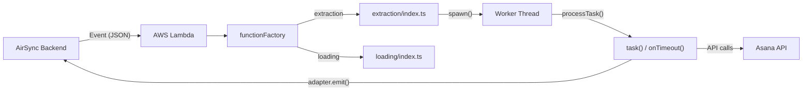

# Asana AirSync Connector

> **Maintenance rule:** This file and `docs/tdd.md` must be kept up to date with every code change. When you add, remove, rename, or restructure files, functions, record types, or fields — update both documents accordingly before finishing the task.

DevRev AirSync connector for Asana. Supports bidirectional synchronization: extraction (Asana → DevRev) of tasks, subtasks, users, tags, comments, attachments, links, groups (teams), group memberships, and access rules (project permissions), and loading (DevRev → Asana) of tasks, subtasks, comments, links, and attachments. Supports initial, incremental, and time-scoped syncs.

Runs as a **snap-in** (plug-in) on AWS Lambda using the `@devrev/ts-adaas` SDK. Each sync operates on an **Asana Project** as its sync unit, selected by the user from their workspace.

## Key Concepts

- **AirSync / Airdrop**: DevRev's data synchronization framework for migrating and keeping data in sync between DevRev and external systems.
- **Snap-in**: A plug-in deployed to AWS Lambda. Max execution time is 15 minutes (hard timeout); the SDK sends a soft timeout signal at ~10-13 minutes so the worker can save state and exit gracefully.
- **`@devrev/ts-adaas` SDK**: The core SDK this connector is built on. Public npm package and open-source repo at https://github.com/devrev/adaas-sdk. Handles state persistence between Lambda invocations, file uploads (artifacts), worker orchestration (main thread + worker threads), attachment streaming, event handling, and the AirSync control protocol. Key exports used by this connector: `spawn`, `processTask`, `WorkerAdapter`, `AirdropEvent`, `ExtractorEventType`, `EventType`, `SyncMode`, `RepoInterface`, `NormalizedItem`, `NormalizedAttachment`.
- **Extraction (forward sync)**: Pulling data from Asana into DevRev.
- **Loading (reverse sync)**: Pushing data from DevRev back to Asana. Supports tasks, subtasks, comments (create-only), links, and attachments.
- **External Sync Unit (ESU)**: An Asana project — the boundary of a single sync operation.
- **Sync run**: One end-to-end extract-transform-load execution of a sync unit, comprised of sequential phases.
- **Initial sync**: The first sync run, triggered manually by the user. Extracts all data from the selected Asana project. Includes the ESU extraction phase.
- **Incremental (1-way) sync**: Any sync after the initial. Only extracts data created or updated within the time window defined by the platform's `extract_from` and `extract_to` event parameters, using Asana's `modified_since` API parameter (lower bound) and client-side filtering (upper bound).
- **2-way sync**: A reverse sync run from DevRev back to the external system (loading phases).
- **Time-scoped sync**: Extraction within a custom time window, configured via `extract_from` and `extract_to` event parameters. The platform resolves these from `extraction_start_time` and `extraction_end_time`. Tasks use Asana's `modified_since` API parameter for the lower bound; the upper bound is applied client-side. Subtasks, comments, and attachments are filtered client-side on both bounds.
- **Domain mapping**: Field-level mapping between Asana and DevRev entities, defined in `initial_domain_mapping.json`. Installed with the snap-in and configurable by end users during import.
- **External domain metadata**: A JSON schema (`external_domain_metadata.json`) describing the external system's domain model — record types, fields, enums, references, stage diagrams, and more.

## Event-Driven Architecture

The snap-in is triggered by JSON events sent by the AirSync backend. Each event follows the `AirdropEvent` structure from `@devrev/ts-adaas`. Based on `event.payload.event_type`, different phases of extraction or loading are executed.

### Extraction event types and phases (in order)

| Event Type | Worker File | When |
|---|---|---|
| `START_EXTRACTING_EXTERNAL_SYNC_UNITS` | `external-sync-units-extraction.ts` | Initial sync only |
| `START_EXTRACTING_METADATA` | `metadata-extraction.ts` | Every sync |
| `START_EXTRACTING_DATA` / `CONTINUE_EXTRACTING_DATA` | `data-extraction.ts` | Every sync |
| `START_EXTRACTING_ATTACHMENTS` / `CONTINUE_EXTRACTING_ATTACHMENTS` | `attachments-extraction.ts` | Every sync |

### Loading event types and phases (in order)

| Event Type | Worker File | When |
|---|---|---|
| `START_LOADING_DATA` / `CONTINUE_LOADING_DATA` | `load-data.ts` | Every 2-way sync |
| `START_LOADING_ATTACHMENTS` / `CONTINUE_LOADING_ATTACHMENTS` | `load-attachments.ts` | Every 2-way sync |

### Response events emitted by the snap-in

Each worker must emit exactly one response event per invocation:

- `*_DONE` — phase completed successfully
- `*_PROGRESS` — runtime limit reached; AirSync will restart the snap-in immediately with a `*_CONTINUE` event
- `*_DELAY` — rate-limited by external system; AirSync will restart after the specified delay (seconds)
- `*_ERROR` — phase failed

### Execution flow



1. **Entry point**: `code/src/index.ts` exports `functionFactory` from `function-factory.ts`, which maps `"extraction"` and `"loading"` to their respective `run` functions.
2. **Extraction orchestrator**: `extraction/index.ts` iterates over events and calls `spawn()` from the SDK, passing `initialState`, `initialDomainMapping`, and `baseWorkerPath`. The SDK routes to the correct worker file based on the event type.
3. **Workers**: Each worker calls `processTask()` with `task` and `onTimeout` handlers. The `task` function receives a `WorkerAdapter` providing access to `adapter.state`, `adapter.getRepo()`, `adapter.emit()`, `adapter.streamAttachments()`, and `adapter.event`.
4. **Data flow**: Data fetched from Asana is normalized (Asana format to DevRev format) and pushed to repos via `adapter.getRepo(itemType)?.push(items)`. The SDK uploads repo contents as JSONL artifacts to the AirSync platform.

## Repository Structure

```
airdrop-asana-snap-in-internal/
├── manifest.yaml                    # Snap-in manifest (functions, keyrings, imports)
├── marketplace.yaml                 # Per-environment marketplace config (dev/qa/prod)
├── docs/
│   ├── prd.md                       # Product requirements document
│   └── tdd.md                       # Technical design document
├── code/
│   ├── package.json
│   ├── tsconfig.json                # Path aliases: @utils/*, @asana/*, @functions/*
│   ├── jest.config.js
│   ├── .env.example
│   ├── scripts/
│   │   ├── deploy.sh                # Deploy (local ngrok or Lambda)
│   │   ├── create-keyring.sh        # Create OAuth developer keyring
│   │   └── cleanup.sh               # Remove snap-in packages/versions
│   ├── src/
│   │   ├── index.ts                 # Entry point — exports functionFactory
│   │   ├── function-factory.ts      # Maps "extraction" and "loading" to run functions
│   │   ├── asana/
│   │   │   ├── api-client/
│   │   │   │   ├── index.ts           # AsanaClient — REST API methods (read + write)
│   │   │   │   └── generated/         # Auto-generated Asana API client (DO NOT EDIT)
│   │   │   ├── constants.ts            # Item types, link types, MAX_SUBTASK_DEPTH, custom field types
│   │   │   ├── types.ts               # Asana type definitions
│   │   │   ├── data-normalization.ts   # Asana → DevRev normalizers
│   │   │   ├── data-denormalization.ts # DevRev → Asana denormalizers
│   │   │   ├── initial_domain_mapping.json    # Field-level mapping config
│   │   │   └── external_domain_metadata.json  # External domain metadata schema
│   │   ├── functions/
│   │   │   ├── extraction/
│   │   │   │   ├── index.ts         # Extraction orchestrator (spawn + initialState)
│   │   │   │   └── workers/
│   │   │   │       ├── external-sync-units-extraction.ts
│   │   │   │       ├── metadata-extraction.ts
│   │   │   │       ├── data-extraction.ts
│   │   │   │       └── attachments-extraction.ts
│   │   │   └── loading/
│   │   │       ├── index.ts         # Loading orchestrator (spawn + initialState)
│   │   │       └── workers/
│   │   │           ├── load-data.ts         # Task, subtask, comment, link loading
│   │   │           └── load-attachments.ts  # Attachment upload to Asana
│   │   ├── utils/
│   │   │   ├── data-helpers.ts      # Core extraction: users, tags, groups, tasks, subtasks, comments, state prep
│   │   │   ├── attachment-helpers.ts # Attachment text parsing and extraction from tasks/comments
│   │   │   ├── field-extraction-helpers.ts  # Pure data transformation: timestamps, custom fields, section extraction
│   │   │   ├── metadata-helpers.ts  # Custom field and section metadata
│   │   │   ├── external-sync-units-helpers.ts  # Project listing and ESU building
│   │   │   ├── permissions-helpers.ts # Project membership → access rules extraction
│   │   │   ├── rich-text-helpers.ts  # Bidirectional rich text: Asana HTML ↔ AirSync rich text
│   │   │   ├── loading-helpers.ts   # Loading error handling, ID resolution via mappers
│   │   │   └── serialize-error.ts   # Error serialization
│   └── test/                        # Local test server (Express on port 8000)
│       ├── main.ts
│       ├── runner.ts
│       ├── types.ts
│       └── http_client.ts
```

`code/src/asana/api-client/generated/` is auto-generated from the Asana OpenAPI spec via `npm run api-gen`. Do not edit these files manually.

## Entities Extracted

| Asana Entity | DevRev Entity | Record Type / Notes |
|---|---|---|
| Task | Issue (Work) | `ext_object_type: "Task"` |
| Subtask | Issue (Work) | `ext_object_type: "Subtask"`, max depth 2 (`MAX_SUBTASK_DEPTH`) |
| User | Dev User | Mapped by email, read-only |
| Tag | Tag | Workspace-level tags |
| Comment (Story) | Comment | Asana stories with `type === 'comment'`; extract-only (Asana API does not support comment updates) |
| Attachment | Attachment | Streamed via `adapter.streamAttachments()`; includes inline images from `html_notes` |
| Link | Link | `is_parent_of` (task → subtask) and `is_dependent_on` (task dependencies) |
| Team | Group | Workspace-level teams extracted as DevRev groups |
| Team Membership | Object Member | One record per team with all member user GIDs |
| Project Membership | Access Rule | One access rule per distinct access level (admin, editor, commenter, viewer) |

## Key Files Reference

| File | Purpose |
|---|---|
| `code/src/asana/api-client/index.ts` | `AsanaClient` class — all Asana REST API calls (read + write: tasks, subtasks, users, tags, custom fields, stories, sections, projects, attachments, dependencies). Includes built-in HTTP retry logic (3 retries, exponential backoff 1s/2s/4s for network errors and 5xx). |
| `code/src/asana/types.ts` | Asana type definitions — re-exports from generated API types plus local types (`AsanaAttachment`, `AsanaLink`, `ListResponse`, `PaginatedRequest`) |
| `code/src/asana/data-normalization.ts` | Normalizer functions that convert Asana objects to DevRev `NormalizedItem` / `NormalizedAttachment` format |
| `code/src/asana/data-denormalization.ts` | Denormalizer functions that convert DevRev data back to Asana API format (`denormalizeTask`, `denormalizeComment`, `denormalizeLink`) |
| `code/src/asana/initial_domain_mapping.json` | Field-level mapping configuration between Asana and DevRev (forward and reverse, transformation methods) |
| `code/src/asana/external_domain_metadata.json` | Base metadata schema describing Asana's domain model for AirSync |
| `code/src/functions/extraction/index.ts` | Extraction orchestrator — defines `ExtractorState`, `initialState`, calls `spawn()` |
| `code/src/functions/extraction/workers/*.ts` | Individual extraction workers (one per phase) |
| `code/src/functions/loading/index.ts` | Loading orchestrator — defines `LoaderState`, calls `spawn()` |
| `code/src/functions/loading/workers/load-data.ts` | Data loading worker — creates/updates tasks, subtasks, comments, and links in Asana via `adapter.loadItemTypes()` |
| `code/src/functions/loading/workers/load-attachments.ts` | Attachment loading worker — downloads from DevRev and uploads to Asana via multipart form |
| `code/src/utils/data-helpers.ts` | Core extraction logic: `extractUsers`, `extractTags`, `extractGroups`, `extractTasks`, subtask/comment/link extraction, pagination, `prepareStateForExtraction` |
| `code/src/utils/field-extraction-helpers.ts` | Pure data transformation: `toTimestamp`, `toDateOnly`, `extractCustomFields`, `extractSectionFromMemberships` |
| `code/src/utils/attachment-helpers.ts` | Attachment text parsing: `extractInlineAttachmentGids`, `extractAttachmentGidFromCommentText`, `stripAssetUrlsFromText`, `extractAttachmentsFromTask` |
| `code/src/utils/permissions-helpers.ts` | `extractPermissions` — fetches project memberships and produces access rule records per access level |
| `code/src/utils/metadata-helpers.ts` | Metadata enrichment: custom field type mapping, section fetching, stage diagram building |
| `code/src/utils/external-sync-units-helpers.ts` | Project listing and ESU construction with task counts |
| `code/src/utils/rich-text-helpers.ts` | Bidirectional rich text conversion: `parseAsanaRichText` (Asana HTML → AirSync rich text for extraction), `serializeToAsanaHtml` and `serializeToPlainText` (AirSync rich text → Asana HTML/plain text for loading) |
| `code/src/utils/loading-helpers.ts` | `handleLoadingError` (429 → delay, others → error string), `resolveExternalId` (DevRev ID → Asana GID via mappers) |
| `code/src/asana/constants.ts` | Item type enums (incl. `GROUPS`, `GROUP_MEMBERSHIPS`, `ACCESS_RULES`), link type constants, access level constants, `MAX_SUBTASK_DEPTH = 2` |
| `manifest.yaml` | Snap-in manifest — functions (`extraction`, `loading`), keyrings (OAuth2 + PAT), imports, service account scopes |

## State Management

State persists across Lambda invocations via the SDK. The connector defines `ExtractorState` in `code/src/functions/extraction/index.ts`:

```typescript
interface ExtractorState {
  users:             { completed: boolean; offset: string; total: number };
  tasks:             { completed: boolean; offset: string; total: number; lastExtractedTaskIndex: number };
  tags:              { completed: boolean; offset: string; total: number };
  subtasks:          { completed: boolean; total: number };
  comments:          { completed: boolean; total: number };
  attachments:       { completed: boolean; total: number };
  links:             { completed: boolean; total: number };
  groups:            { completed: boolean; offset: string; total: number };
  group_memberships: { completed: boolean; total: number };
  access_rules:      { completed: boolean; total: number };
}
```

- **`completed`**: Whether extraction for this entity type is finished.
- **`offset`**: Asana pagination token for resuming where extraction left off.
- **`total`**: Running count of extracted items.
- **`lastExtractedTaskIndex`**: Index within a page of tasks for resuming after timeout mid-page.

The SDK persists state automatically when events are emitted. On the next invocation, state is restored so extraction can resume. The `prepareStateForExtraction` function in `data-helpers.ts` resets entity progress for incremental syncs. Time-scoped extraction bounds (`extract_from` and `extract_to`) are read directly from `adapter.event.payload.event_context` — they are not stored in state.

## Asana API and Error Handling

- **Base URL**: `https://app.asana.com/api/1.0`
- **Authentication**: Bearer token from `event.payload.connection_data.key` (works for both OAuth and PAT)
- **Workspace**: `event.payload.connection_data.org_id`
- **Project (sync unit)**: `event.payload.event_context.external_sync_unit_id`
- **Pagination**: All list endpoints use offset-based pagination with page size 100
- **Rate limiting (429)**: Not retried by the HTTP client. Instead, `handleExtractionError` in `data-helpers.ts` reads the `Retry-After` header (default 60s) and returns `{ delay }`. The worker then emits a `*_DELAY` event so AirSync can restart after the delay.
- **Retries**: The HTTP client retries 3 times with exponential backoff (1s, 2s, 4s) for network errors and 5xx responses only. 4xx errors (including 429) are not retried by the client.

## Development Workflow

### Prerequisites

Node.js 18+, [DevRev CLI](https://developer.devrev.ai/snap-in-development/references/cli-install), [jq](https://stedolan.github.io/jq/download/), [ngrok](https://ngrok.com/download) (for local development).

### Commands

All commands run from the `code/` directory unless otherwise noted.

| Command | Description |
|---|---|
| `npm ci` | Install dependencies |
| `npm run build` | Compile TypeScript (`rimraf dist && tsc && tsc-alias`) |
| `npm run package` | Build and create `build.tar.gz` for Lambda deployment |
| `npm run deploy` | Interactive deploy (local via ngrok or Lambda) |
| `npm run test` | Run Jest unit tests |
| `npm run test:server` | Start local dev server (Express on port 8000 with nodemon) |
| `npm run lint` / `npm run lint:fix` | ESLint |
| `npm run api-gen` | Regenerate Asana API client from OpenAPI spec |
| `npm run create-keyring` | Create OAuth developer keyring in DevRev |
| `npm run cleanup` | Remove snap-in packages/versions |

### Path Aliases

The project uses TypeScript path aliases configured in `tsconfig.json`:

- `@utils/*` → `./src/utils/*`
- `@asana/*` → `./src/asana/*`
- `@functions/*` → `./src/functions/*`

These are resolved at build time by `tsc-alias` and mapped in `jest.config.js` for tests.

## Testing

- **Unit tests**: 19 test files in `code/src/**/*.test.ts` covering API client, data normalization, data denormalization, data helpers, attachment helpers, field extraction helpers, metadata helpers, permissions helpers, rich text helpers, external sync units helpers, error serialization, loading helpers, loading orchestrator, load data worker, load attachments worker, and extraction workers (ESU, metadata, data, attachments).
- **Framework**: Jest with `ts-jest` preset, path aliases mapped in `jest.config.js`.
- **Local integration testing**: Test server in `code/test/` (Express on port 8000) simulates the AirSync platform for local development with ngrok.

## Important Constraints and Gotchas

- **Lambda timeout**: Max 15 minutes. The SDK sends a soft timeout at ~10-13 minutes. Workers must handle `onTimeout` gracefully by saving state and emitting a progress/error event.
- **Subtask depth**: Limited to 2 levels (`MAX_SUBTASK_DEPTH`) due to DevRev link depth constraints. Tasks → subtasks → sub-subtasks.
- **Attachment URLs expire**: Asana `download_url` values expire in ~2 minutes. Attachments must be streamed during the attachments extraction phase, not stored for later.
- **Comments are create-only**: The Asana API does not support updating or deleting comments (stories). Loading creates new comments but updates are no-op.
- **Generated code**: `code/src/asana/api-client/generated/` is auto-generated from the Asana OpenAPI spec. Do not edit manually; regenerate with `npm run api-gen`.
- **429 handling**: Rate limit responses are not retried by the HTTP client. They are handled at the worker level (extraction and loading) by emitting a `*_DELAY` event with the `Retry-After` value.
- **State size**: Snap-in state must be smaller than 1 MB (~500,000 characters).
- **Single response**: Each worker invocation must emit exactly one response event to AirSync.

## Related Documentation

### Internal

- `docs/prd.md` — Product requirements document
- `docs/tdd.md` — Technical design document (data mapping, API endpoints, limitations)
- `README.md` — Setup, authentication (PAT/OAuth), deployment instructions

### `@devrev/ts-adaas` SDK

- **npm**: https://www.npmjs.com/package/@devrev/ts-adaas
- **GitHub** (source, types, tests, examples): https://github.com/devrev/adaas-sdk

### Asana API

- https://developers.asana.com/reference/rest-api-reference

### DevRev AirSync Documentation

Primary reference for the framework: https://developer.devrev.ai/airsync

All subpages (each has a "Copy Markdown" button for easy reference):

**Getting Started:**

- `/getting-started` — Fundamental concepts: sync unit, sync run, forward/reverse sync, initial sync, incremental (1-way) sync, 2-way sync, time-scoped sync.
- `/snap-in-template` — Starter template structure, SDK features (type definitions, error/timeout support, artifact management, state handling, event management).
- `/local-development` — Local dev setup with ngrok, test server, initial sync walkthrough, event-driven communication with the AirSync platform.
- `/manifest` — `manifest.yaml` configuration: functions, keyrings (secret/OAuth2), connection types, subdomain handling, organization data, imports.

**Extraction (forward sync):**

- `/extraction-phases` — Extraction lifecycle overview, `processTask`/`spawn` usage, state management across invocations, four phases (ESU, metadata, data, attachments).
- `/external-sync-units-extraction` — ESU phase: listing sync units with id/name/description/item_count, event types (`EXTRACTION_EXTERNAL_SYNC_UNITS_START`/`DONE`/`ERROR`), initial sync only.
- `/metadata-extraction` — `external_domain_metadata.json` schema: record types, categories, fields (text/enum/reference/rich_text/timestamp/etc.), collections, stage diagrams, custom link types, field attributes (`is_read_only`/`is_required`/etc.), validation with chef-cli, `infer-metadata` command.
- `/initial-domain-mapping` — Field mapping between external and DevRev schemas via Chef UI or MCP; category-based defaults, multiple mapping options, blueprint apply/merge workflow, custom object mapping.
- `/data-extraction` — Data extraction phase: event types (`EXTRACTION_DATA_START`/`CONTINUE`/`PROGRESS`/`DELAY`/`DONE`/`ERROR`), repos and `push()`, normalization rules (timestamps, nulls, references, multiselect), state handling, Lambda timeout (soft 10min / hard 13min), time-scoped syncs with `extract_from` and `reset_extract_from`, special error events (`USER_DELETED`/`EXTERNAL_SYNC_UNIT_DEACTIVATED`/`DELETED`).
- `/extract-attachments` — Attachments extraction phase: event types, `streamAttachments` API with `stream` function and `batchSize`, default vs custom implementation.
- `/customize-attachment-processing` — Custom attachment processing: reducer/iterator pattern for URL refresh, grouping, re-fetching expired URLs, `processAttachment` API.

**Loading (reverse sync):**

- `/loading-phases` — Loading lifecycle overview: load data and load attachments phases, separate `LoaderState`, state handling, creating items in DevRev for 2-way sync.
- `/load-data` — Load data phase: `loadItemTypes` API with ordered item types, `create`/`update` functions for denormalization and HTTP calls, rate limiting, event types (`START_LOADING_DATA`/`CONTINUE_LOADING_DATA`/`DATA_LOADING_DONE`).
- `/load-attachments` — Load attachments phase: `loadAttachments` API with `create` function, event types (`START_LOADING_ATTACHMENTS`/`CONTINUE`/`DONE`).

**Advanced:**

- `/object-mappers` — Sync mapper records: bidirectional lookup table between external IDs and DevRev entity IDs, `adapter.mappers` API (`getByExternalId`, `getByTargetId`, `create`, `update`), essential for loading and relationship management.
- `/mcp` — MCP integration for AI-assisted initial domain mapping creation via `chef-cli mcp initial-mapping`; Cursor/Claude Code setup, available operations.
- `/faq` — Common issues: deployment conflicts, token expiration, metadata tips (record types, categories, integers, collections, structs, custom fields), chef-cli version compatibility.

**Data Model:**

- `/supported-object-types` — DevRev object types available for mapping (issues, tickets, conversations, articles, custom objects, etc.) and their supported fields.
- `/data-model/rich-text-fields` — Rich text format: markdown arrays with mention objects (`ref_type`, `id`, `fallback_record_name`), article importing with inline attachments (artifact references) and article cross-links.
- `/data-model/mapping-reasons` — Transformation methods reference: `use_directly`, `make_custom_stages`, `map_enum`, `use_rich_text`, `use_fixed_value`, `use_raw_jq`, `make_constrained_simple_value`, `reference_custom_field`, `construct_text_field`, etc.; reasons why certain mappings may be unavailable (type mismatches, struct limitations, link restrictions).
